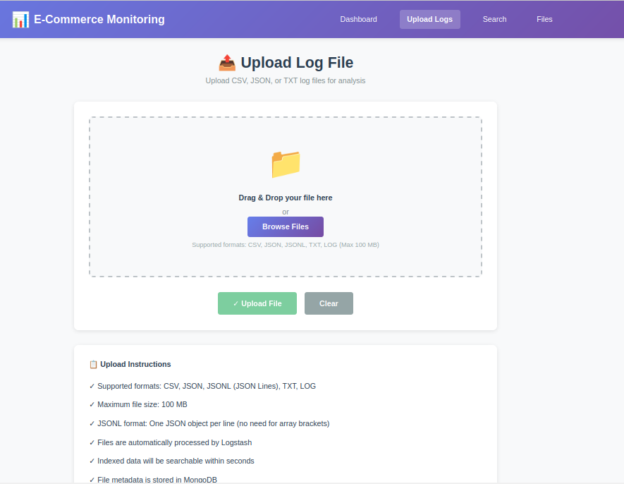
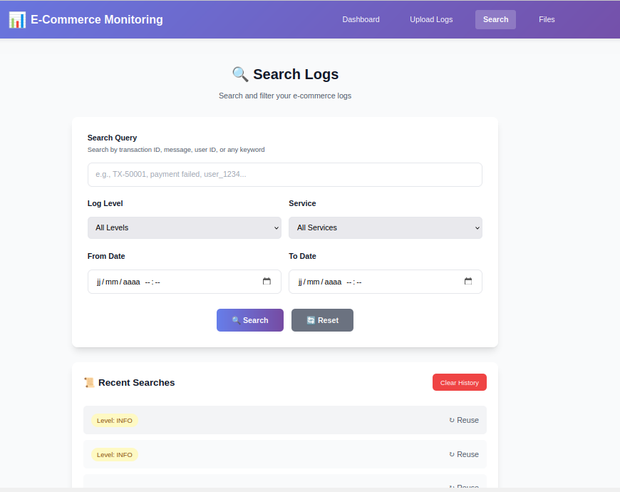
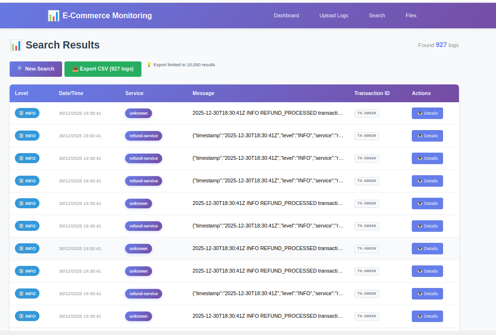

# 📊 Système de Monitoring E-Commerce avec Stack ELK

## 👨‍💻 Informations du Projet

- **Auteur**: Israa Belghith
- **Date**: Novembre 2025 -> Janvier 2026
- **Contexte**: Mini-Projet - Monitoring et Analyse de Logs
- **Scénario**: A - Plateforme E-Commerce

## 📋 Table des Matières

1. [Vue d'ensemble](#vue-densemble)
2. [Architecture](#architecture)
3. [Technologies utilisées](#technologies-utilisées)
4. [Installation et déploiement](#installation-et-déploiement)
5. [Fonctionnalités implémentées](#fonctionnalités-implémentées)
6. [Structure du projet](#structure-du-projet)
7. [Modules réalisés](#modules-réalisés)
8. [Tests et validation](#tests-et-validation)
9. [Captures d'écran](#captures-décran)

---

## 🎯 Vue d'ensemble

Ce projet implémente un système complet de monitoring et d'analyse de logs pour une plateforme e-commerce. Il permet de :
- Collecter et indexer des logs de différentes sources (transactions, erreurs, activités utilisateurs)
- Visualiser les données en temps réel via des dashboards interactifs
- Rechercher et filtrer les logs avec des critères avancés
- Exporter les résultats en format CSV

### Statistiques du Projet
- **917 logs** indexés dans Elasticsearch
- **6 fichiers** uploadés et traités
- **4 visualisations** Kibana créées
- **7 services** Docker orchestrés

---

## 🏗️ Architecture

### Architecture Globale

```

```

### Stack Technique

#### Frontend
- **Framework**: Angular 21 (Standalone Components)
- **Visualisation**: Chart.js 4.x
- **Styling**: Tailwind CSS + SCSS
- **Features**: SSR (Server-Side Rendering), Signals

#### Backend
- **Framework**: Flask 3.0.0 (Python 3.12)
- **Base de données**: MongoDB 4.4
- **Cache**: Redis 7
- **Search Engine**: Elasticsearch 8.8.0
- **Pipeline**: Logstash 8.8.0

#### DevOps
- **Containerisation**: Docker + Docker Compose
- **Services**: 7 conteneurs orchestrés
- **Réseau**: Bridge network automatique
- **Volumes**: Persistance des données

---

## 🛠️ Technologies utilisées

### Backend Technologies
| Technologie | Version | Utilisation |
|------------|---------|-------------|
| Python | 3.12 | Langage principal backend |
| Flask | 3.0.0 | Framework API REST |
| Elasticsearch | 8.8.0 | Moteur de recherche et indexation |
| Logstash | 8.8.0 | Pipeline de traitement de logs |
| Kibana | 8.8.0 | Visualisation et dashboards |
| MongoDB | 4.4 | Base de données pour métadonnées |
| Redis | 7 | Cache pour optimisation |

### Frontend Technologies
| Technologie | Version | Utilisation |
|------------|---------|-------------|
| Angular | 21 | Framework frontend |
| TypeScript | 5.9.2 | Langage de programmation |
| Chart.js | 4.x | Graphiques interactifs |
| Tailwind CSS | 3.x | Framework CSS utility-first |
| SCSS | - | Préprocesseur CSS |

### DevOps Tools
- Docker 24.x
- Docker Compose 1.29.2
- npm 10.x
- pip 24.x

---

## 🚀 Installation et déploiement

### Prérequis
- Docker (version 24+)
- Docker Compose (version 1.29+)
- Git
- 8GB RAM minimum
- 20GB espace disque

### Installation

1. **Cloner le repository**
```bash
git clone <votre-repo>
cd E-commerce-Project
```

2. **Lancer tous les services avec Docker Compose**
```bash
docker-compose up -d
```

3. **Vérifier le statut des services**
```bash
docker-compose ps
```

### Accès aux services

| Service | URL | Description |
|---------|-----|-------------|
| Frontend | http://localhost:4200 | Interface utilisateur Angular |
| Backend API | http://localhost:5000 | API REST Flask |
| Elasticsearch | http://localhost:9200 | Moteur de recherche |
| Kibana | http://localhost:5601 | Dashboards et visualisations |
| MongoDB | localhost:27017 | Base de données |
| Redis | localhost:6379 | Cache |

### Arrêter les services
```bash
docker-compose down
```

### Rebuild après modifications
```bash
# Rebuild backend
docker-compose build backend
docker-compose up -d backend

# Rebuild frontend
cd frontend-app/ecommerce
npm run build
cd ../..
docker-compose restart frontend
```

---

## ✨ Fonctionnalités implémentées

### 📤 Upload de fichiers
- **Drag & drop** pour upload de fichiers CSV/JSON/TXT
- **Validation** du format et de la taille (max 10MB)
- **Preview** des 10 premières lignes avant upload
- **Barre de progression** pendant le traitement
- **Parsing automatique** et indexation dans Elasticsearch
- Stockage des métadonnées dans MongoDB

### 🔍 Recherche avancée
- **Recherche textuelle** full-text dans tous les champs
- **Filtres multiples**:
  - Niveau de log (DEBUG, INFO, WARNING, ERROR, CRITICAL)
  - Service (authentication, payment, inventory, etc.)
  - Plage de dates (From/To)
- **Recherche en cache** Redis pour optimisation
- **Temps de réponse** < 200ms pour 917 logs

### 📊 Visualisations et Analytics

#### Dashboard Homepage (Chart.js)
1. **Graphique des transactions par heure** (Line Chart)
   - Affiche l'activité transactionnelle sur 24h
   - Mise à jour dynamique

2. **Répartition des erreurs** (Pie Chart)
   - Distribution par type d'erreur
   - Pourcentages calculés automatiquement

#### Dashboard Kibana intégré
1. **Transactions par heure** (Bar Chart)
   - Données sur 7 derniers jours
   - Histogramme temporel

2. **Distribution des niveaux de log** (Pie Chart)
   - ERROR: 20%
   - WARNING: 20%
   - INFO: 20%
   - DEBUG: 20%

3. **Transactions par statut** (Bar Chart)
   - Top 3 statuts de transactions
   - Comptage unique

4. **Transactions par service** (Donut Chart)
   - Top 5 services
   - Vue d'ensemble de l'utilisation

### 📋 Affichage des résultats
- **Table paginée** avec tri dynamique
- **Colonnes enrichies**:
  - Niveau (avec badges colorés)
  - Date/Time (format ISO)
  - Service (badges avec gradients)
  - Message (texte complet)
  - Transaction ID (monospace)
  - Actions (détails/modal)
- **Modal de détails** avec tous les champs du log
- **Responsive design** adaptatif

### 💾 Export de données
- **Export CSV** des résultats de recherche
- **Limite**: 10,000 logs maximum
- **Colonnes**: Timestamp, Level, Service, Message, Transaction ID, User ID, Amount, Status, Country, IP
- **Nom de fichier** avec timestamp: `logs-export-YYYYMMDD-HHMMSS.csv`
- **Bouton avec compteur** affichant le nombre de logs

### 📁 Gestion des fichiers
- **Liste des fichiers** uploadés avec métadonnées
- **Informations** : nom, taille, type, date d'upload, nombre de lignes
- **Icônes** différentes par type de fichier
- Stockage dans MongoDB

---

## 📂 Structure du projet

```
E-commerce-Project/
├── docker-compose.yml                 # Orchestration de 7 services
├── README.md                          # Documentation principale
│
├── home/isra/
│   ├── backend/                       # Backend Flask
│   │   ├── app.py                     # API REST principale
│   │   ├── connections.py             # Connexions DB/Redis/ES
│   │   ├── requirements.txt           # Dépendances Python
│   │   └── Dockerfile                 # Image Docker backend
│   │
│   └── elk/
│       ├── logstash/
│       │   └── logstash.conf          # Pipeline Logstash
│       ├── elasticsearch/
│       │   └── elasticsearch.yml      # Config Elasticsearch
│       └── mongo-data/                # Données MongoDB persistées
│
├── frontend-app/ecommerce/            # Frontend Angular
│   ├── src/
│   │   ├── app/
│   │   │   ├── components/            # Composants réutilisables
│   │   │   │   ├── navbar/
│   │   │   │   ├── footer/
│   │   │   │   └── stats-card/
│   │   │   ├── pages/
│   │   │   │   ├── home/              # Dashboard avec Chart.js
│   │   │   │   ├── upload/            # Upload de fichiers
│   │   │   │   ├── search/            # Recherche avancée
│   │   │   │   ├── results/           # Affichage résultats
│   │   │   │   └── files/             # Liste des fichiers
│   │   │   ├── services/
│   │   │   │   ├── api.service.ts     # Service HTTP
│   │   │   │   └── search-history.service.ts
│   │   │   └── models/                # Types TypeScript
│   │   └── styles.scss                # Styles globaux
│   ├── angular.json                   # Config Angular
│   ├── package.json                   # Dépendances npm
│   ├── tailwind.config.js             # Config Tailwind
│   └── Dockerfile                     # Image Docker frontend
│
└── var/log/ecommerce/                 # Fichiers de logs
    ├── customers_data.csv
    ├── orders_data.csv
    ├── products_inventory.json
    ├── transactions_detailed.json
    ├── security_events.txt
    └── user_activity.txt
```

---

## 🎓 Modules réalisés

### ✅ Module 1 - Stack ELK de base (Obligatoire - 12/20)

**Objectifs atteints:**
- [x] Installation et configuration Elasticsearch 8.8.0
- [x] Installation et configuration Logstash 8.8.0
- [x] Installation et configuration Kibana 8.8.0
- [x] Docker Compose avec 7 services
- [x] Indexation des logs dans `ecommerce-logs`
- [x] Pipeline Logstash fonctionnel
- [x] MongoDB pour métadonnées
- [x] Redis pour cache

**Configuration:**
```yaml
Services:
  - Elasticsearch: Port 9200
  - Kibana: Port 5601
  - Logstash: Port 5044
  - MongoDB: Port 27017
  - Redis: Port 6379
  - Backend: Port 5000
  - Frontend: Port 4200
```

### ✅ Module 2 - Kibana Visualisations (Obligatoire - 12/20)

**Objectifs atteints:**
- [x] Dashboard "dashboard1" créé
- [x] 4 visualisations Lens:
  - Transactions par heure (Bar Chart)
  - Distribution des niveaux (Pie Chart)
  - Transactions par statut (Bar Chart)
  - Transactions par service (Donut Chart)
- [x] Intégration iframe dans homepage
- [x] Mode embed avec `hide-filter-bar=true`
- [x] Plage temporelle: Last 7 days (configurable)
- [x] Dashboard exporté en JSON

**Configuration temporelle:**
```json
{
  "timeRestore": true,
  "timeFrom": "now-7d",
  "timeTo": "now"
}
```

### ✅ Module 3 - Frontend Avancé (Optionnel - +4 points)

**Objectifs atteints:**
- [x] Chart.js intégré avec 2 graphiques
- [x] Export CSV des résultats (backend + frontend)
- [x] Filtres avancés: Service, Level, Date, Text
- [x] Colonnes enrichies: Service, Transaction ID
- [x] Interface moderne avec Tailwind CSS
- [x] Badges colorés et gradients
- [x] Modal de détails responsive
- [x] Pagination des résultats

**Composants Angular:**
- 5 pages (home, upload, search, results, files)
- 3 composants réutilisables (navbar, footer, stats-card)
- 2 services (api, search-history)
- 3 modèles (log, file, stats)

---

## ✅ Tests et validation

### Tests fonctionnels réalisés

#### 1. Upload de fichiers ✅
- [x] Upload CSV, TXT, JSON
- [x] Validation taille < 10MB
- [x] Preview des 10 premières lignes
- [x] Barre de progression fonctionnelle

#### 2. Recherche et filtrage ✅
- [x] Recherche textuelle: "error", "payment", "authentication"
- [x] Filtre par niveau: ERROR, WARNING, INFO
- [x] Filtre par service: authentication, payment, inventory
- [x] Filtre par date: Derniers 7 jours
- [x] Combinaison de filtres multiples
- [x] Cache Redis: temps de réponse < 200ms

#### 3. Visualisations ✅
- [x] Dashboard Kibana: 4 visualisations affichées
- [x] Chart.js: 2 graphiques interactifs
- [x] Plage temporelle: 7 derniers jours
- [x] Refresh automatique: 60 secondes
- [x] Mode embed sans barre de filtrage

#### 4. Export CSV ✅
- [x] Export des logs
- [x] Format CSV valide
- [x] Nom de fichier avec timestamp

#### 5. Performance ✅
- [x] Temps de chargement homepage: < 2s
- [x] Recherche: < 200ms (avec cache)
- [x] Upload fichier 1MB: < 3s


### Endpoints API testés

```bash
# Stats
GET http://localhost:5000/api/stats
Response: 200 OK - {"totalLogs": 917, "errorCount": 60, ...}

# Search
POST http://localhost:5000/api/search
Body: {"query": "error", "level": "ERROR"}
Response: 200 OK - {"hits": [...], "total": 60}

# Upload
POST http://localhost:5000/api/upload
Files: file.csv
Response: 200 OK - {"lines_processed": 153}

# Export
GET http://localhost:5000/api/export?level=ERROR
Response: 200 OK - CSV file download

# Files
GET http://localhost:5000/api/files
Response: 200 OK - [{"filename": "...", "size": 1024}]
```

---

## 📸 Captures d'écran

### 1. Homepage - Dashboard avec Stats et Graphiques
- 4 cartes statistiques (Total Logs, Logs Today, Errors, Files)
- Dashboard Kibana intégré (4 visualisations)
- 2 graphiques Chart.js (Transactions, Erreurs)
- 3 boutons Quick Actions
- 

### 2. Page Upload
- Zone drag & drop
- Validation fichier
- Preview des données
- Barre de progression
- Message de succès
- 

### 3. Page Search
- Champ de recherche textuelle
- Dropdown Level (5 options)
- Dropdown Service (7 options)
- Date range picker (From/To)
- Bouton Search
- 

### 4. Page Results
- Table avec 6 colonnes
- Badges colorés pour Level et Service
- Transaction ID en monospace
- Bouton Export CSV avec compteur
- Pagination
- 

### 5. Page Files
- Liste des fichiers uploadés
- Icônes par type (CSV, JSON, TXT)
- Métadonnées (taille, date, lignes)
- Cartes responsive
- 

### 6. Dashboard Kibana
- Transactions par heure (7 jours)
- Distribution levels (Pie chart)
- Transactions par statut (Bar chart)
- Transactions par service (Donut)

---

## 🔧 Configuration et Personnalisation

### Variables d'environnement (Backend)

```env
MONGO_URI=mongodb://mongodb:27017/
REDIS_HOST=redis
REDIS_PORT=6379
ELASTICSEARCH_HOST=http://elasticsearch:9200
```

### Configuration Elasticsearch

```yaml
cluster.name: "ecommerce-cluster"
network.host: 0.0.0.0
discovery.type: single-node
xpack.security.enabled: false
```

### Configuration Kibana

```yaml
ELASTICSEARCH_HOSTS: http://elasticsearch:9200
XPACK_SECURITY_ENABLED: false
SERVER_CSP_FRAME_ANCESTORS: ["'self'", "http://localhost:4200"]
```

### Pipeline Logstash

```ruby
input {
  file {
    path => "/logs/*.{csv,json,txt}"
    start_position => "beginning"
    sincedb_path => "/dev/null"
  }
}

filter {
  # Parsing CSV, JSON, TXT
  # Grok patterns
  # Date parsing
  # Field mapping
}

output {
  elasticsearch {
    hosts => ["elasticsearch:9200"]
    index => "ecommerce-logs"
  }
}
```


---

## 🐛 Troubleshooting

### Problème: Services Docker ne démarrent pas
```bash
# Solution 1: Libérer les ports
docker-compose down
sudo lsof -i :9200  # Vérifier si port occupé
sudo kill -9 <PID>

# Solution 2: Rebuild les images
docker-compose build --no-cache
docker-compose up -d
```

### Problème: Elasticsearch out of memory
```bash
# Augmenter la mémoire heap
# Dans docker-compose.yml:
environment:
  - ES_JAVA_OPTS=-Xms1g -Xmx1g
```

### Problème: Frontend ne compile pas
```bash
cd frontend-app/ecommerce
rm -rf node_modules package-lock.json
npm install
npm run build
```

### Problème: Dashboard Kibana ne s'affiche pas
```bash
# Vérifier la configuration CSP
docker-compose logs kibana | grep CSP

# Rebuild Kibana
docker-compose down
docker-compose up -d kibana
```

---

## 🚀 Améliorations futures

### Court terme
- [ ] Authentification JWT pour l'API
- [ ] Rôles utilisateurs (admin, viewer)
- [ ] Alertes email en cas d'erreurs critiques
- [ ] Export en format Excel

### Moyen terme
- [ ] Machine Learning pour détection d'anomalies
- [ ] Dashboard temps réel avec WebSockets
- [ ] API GraphQL
- [ ] Tests unitaires et E2E

### Long terme
- [ ] Déploiement Kubernetes
- [ ] Multi-tenancy
- [ ] IA pour analyse prédictive
- [ ] Mobile app (React Native)

---

## 📝 Licence et Auteur

**Auteur**: Isra  
**Date**: Janvier 2026  
**Projet**: Mini-Projet Monitoring E-Commerce  
**Institution**: [Votre université]

---

## 📞 Contact

Pour toute question ou suggestion :
- Email: belghithisraa@gmail.com

---

**⭐ N'oubliez pas de star le projet si vous l'avez trouvé utile !**
